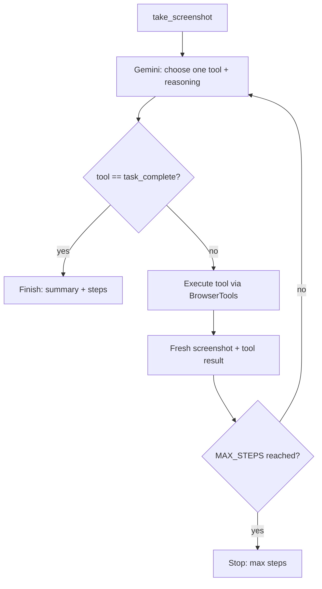

# Architecture

Notes on how the project is structured, the main design choices, and how the
parts connect.

## Design choices

### Vision and coordinate clicks instead of selectors

Most browser automation (Selenium, plain Playwright scripts) works through
CSS/XPath selectors tied to the DOM. Selectors break when markup changes, don't
work on canvas or shadow-DOM content, and need the author to know the page's
internal structure up front.

This agent works from the screenshot instead, clicking where things visually
appear. That makes it general (it doesn't need custom selectors for each page),
and it keeps working when class names or DOM structure change, since a button
still looks like a button. The cost is that the click coordinates have to be
exact, which is the reason for the fixed viewport described below.

### A tool-use loop

Instead of having the model write free-form text that the code then parses, the
agent gives Gemini a fixed set of tools and lets it call them through function
calling. Every action is then one of a known set with a defined argument schema,
so there's no brittle text parsing. The code, not the model, decides what each
tool actually does. Sending the result and a fresh screenshot back as a
function response keeps the conversation in a valid shape for the next turn.

### A model fallback chain

The agent runs on free-tier Gemini keys, where each model has tight per-minute
and per-day quotas. Rather than stopping when a model runs out, the client keeps
an ordered list of models and rotates through it:

- On a 429 (quota or rate limit), it moves to the next model and retries the same
  request.
- On a 404 (the model isn't available for the key), it drops that model and
  doesn't try it again, so a wrong model ID doesn't block the run.
- Each model has its own quota, so several models together give more total
  requests before the chain is used up.

### A fixed viewport

The model points at pixels in the screenshot, so for a click to land correctly
the screenshot's pixel space has to equal the browser's viewport pixel space.
Two things keep that true: the viewport is pinned to `VIEWPORT_WIDTH ×
VIEWPORT_HEIGHT` (1280 × 800 by default), and the browser launches with
`device_scale_factor = 1` so a HiDPI display can't produce a 2x screenshot that
would double every coordinate.

## Agent workflow

The loop runs perceive, decide, act on each iteration:

1. Capture the current viewport as a screenshot (PNG, also base64).
2. Send the screenshot, the goal, and the history to Gemini (rotating models if
   the current one is rate limited). Gemini replies with a short rationale and one
   function call.
3. Run the matching `BrowserTools` method.
4. Capture a fresh screenshot and send it back with the function result, so the
   model sees the outcome.
5. Repeat until the model calls `task_complete` or `MAX_STEPS` is reached.



## The tools

Each tool maps to a method of `BrowserTools`, except `task_complete`, which the
loop handles. Coordinates are viewport/screenshot pixels with the top-left as
the origin.

| Tool | Arguments | What it does |
|------|-----------|--------------|
| `open_browser` | — | Launches Chromium at the fixed viewport, honoring `HEADLESS`. The loop calls it once at startup. |
| `navigate_to_url` | `url` | Loads a URL, with timeout handling. |
| `take_screenshot` | — | Saves a timestamped PNG and returns base64. A fresh screenshot is also returned after every action. |
| `click_on_screen` | `x`, `y` | Clicks at the given pixel coordinates. Used to focus a field before typing. |
| `send_keys` | `text` | Types into the focused element. |
| `scroll` | `direction`, `amount` | Scrolls up or down to bring off-screen content into view. |
| `double_click` | `x`, `y` | Double-clicks at pixel coordinates. |
| `task_complete` | `summary` | Ends the run and returns the summary and step count. |

The system prompt tells the model the order to use: click a field to focus it,
then call `send_keys`. It should never type without clicking first.

## How element detection works

There is no selector engine and no DOM querying. The model does the detection
from the image:

1. It receives the screenshot at the exact viewport resolution.
2. The system prompt gives it the viewport size, notes that coordinates map 1:1,
   and asks it to find the Name and Description fields.
3. It returns the pixel coordinates of each field's center as `click_on_screen`
   arguments.
4. The next screenshot shows the focused field (a caret or highlight), which
   confirms the target before it types.

So the model is the element detector, and the 1:1 coordinate guarantee is what
makes that reliable.

## Error handling

Failures are contained at four levels:

- Configuration: `config.py` checks required settings on import and raises a
  clear `RuntimeError` if `GEMINI_API_KEY` is missing.
- Rate limits and availability: `GeminiClient` catches API errors. On a 429 it
  rotates to the next model and retries; on a 404 it skips that model. It only
  raises `RateLimitExhausted` once the whole chain is used up. The loop reports
  each switch as a `model_switch` event.
- Tools: every `BrowserTools` method wraps its Playwright calls and turns
  timeouts, closed targets, and network errors into a single `ToolError`.
  Teardown is best-effort so a cleanup error doesn't hide the real outcome.
- The loop: a `ToolError` is caught and sent back to Gemini as an error function
  response, so the model can try a different approach instead of the run
  aborting. If the model replies with no function call, the loop nudges it. A
  `MAX_STEPS` cap prevents infinite loops, and the run always ends with a status
  of `finished` or `max_steps`.

Feeding errors back to the model, along with the model fallback, is what lets the
agent recover during a run rather than just stopping.

## How the components fit together

```
  CLI (main.py)          Web UI (server/app.py + static/)
        \                          /
         \                        / WebSocket /ws
          v                      v
        Agent (agent_loop.py)
          - runs the perceive/decide/act loop
          - emits one structured event per step
           /                       \
   decisions                        actions
          v                          v
  GeminiClient (llm_client.py)   BrowserTools (browser_tools.py)
   - tool defs, system prompt     - 7 tools + close()
   - next_action, model chain     - Playwright / Chromium
          v                       - raises ToolError
     Gemini API
   (fallback chain)

  logger.py -> console + logs/agent.log (used by all components)
```

- `browser_tools.py` owns the browser. It launches Chromium, performs the seven
  actions, captures screenshots, and exposes `close()`. Failures become
  `ToolError`.
- `llm_client.py` owns the model side. It defines the tool schemas, builds the
  viewport-aware system prompt, calls Gemini, and runs the rotator that switches
  models on rate limits.
- `agent_loop.py` owns the orchestration. The `Agent` keeps the conversation,
  drives the loop, dispatches each tool call, sends screenshots back, and emits a
  structured event per step through an optional callback.
- `server/app.py` runs the loop in a worker thread (Playwright's sync API blocks
  the event loop otherwise) and forwards each event, with the latest screenshot,
  over a WebSocket. `main.py` runs the same `Agent` from the command line.
- `logger.py` is the shared logging setup.

Both entry points build the same `Agent` and read the same event stream, so the
behavior is the same whether it runs headless or in the dashboard.
