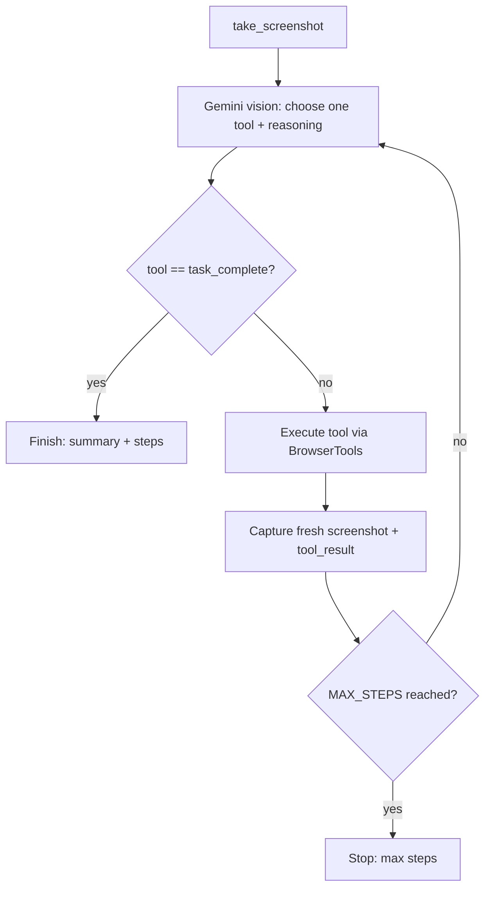

# Architecture

This document explains how the Website Automation Agent is designed, why the key
decisions were made, and how the pieces fit together.

---

## Design decisions (and why)

### Why vision + coordinate-based clicks instead of selectors

Traditional automation (Selenium, raw Playwright scripts) drives pages through
**CSS/XPath selectors** tied to the DOM. That approach is brittle: selectors
break when markup changes, fail on canvas/shadow-DOM/iframe content, and require
the author to know the page's internal structure in advance.

This agent instead **perceives the page the way a human does** — it looks at a
screenshot and clicks where things visually are. The benefits:

- **Generality** — it works on any page without bespoke selectors, including
  components rendered without stable, queryable markup.
- **Robustness to markup churn** — a renamed class or restructured DOM doesn't
  matter; the button still looks like a button.
- **Faithful to the "agent" goal** — the model reasons about an interface from
  pixels, which is the harder and more interesting capability to demonstrate.

The trade-off is that coordinates must be exact, which motivates the fixed
viewport (below).

### Why a tool-use (function-calling) loop

Rather than asking the model to emit free-form text and then parsing it, the
agent exposes a **fixed set of typed tools** and lets Gemini call them via
function calling. This makes the system:

- **Predictable** — every action is one of a known, validated set with a defined
  argument schema, so there's no fragile prompt-output parsing.
- **Safe** — the harness, not the model, decides what each tool actually does.
- **Composable** — feeding results (and a fresh screenshot) back as
  function-response parts closes the loop cleanly and keeps the conversation
  well-formed.

### Why a model fallback chain

The agent runs on Google Gemini with free-tier keys, where each model has tight
per-minute and per-day request quotas. Rather than failing when one model is
exhausted, the LLM client holds an **ordered chain of models** and rotates
through it:

- On a **429 (rate/quota exhausted)** it switches to the next model and retries
  the same request — the run continues seamlessly.
- On a **404 (model not available for this key)** it marks that model unavailable
  and skips it permanently, so an imperfect model ID never blocks a run.
- Because each model has its own independent quota, chaining several
  **multiplies the total requests** available before the whole chain is spent.

This keeps the agent usable on a free key and makes resilience a first-class
property of the design rather than an afterthought.

### Why a fixed viewport

The model points at pixels it sees in a screenshot. For a click to land where
the model intends, **the screenshot's pixel space must equal the browser's
viewport pixel space, 1:1**. Two guarantees enforce this:

- The viewport is pinned to `VIEWPORT_WIDTH × VIEWPORT_HEIGHT` (default
  `1280 × 800`).
- The browser is launched with `device_scale_factor = 1`, so a HiDPI host can't
  produce a 2× screenshot that would silently double every coordinate.

A known, stable coordinate system is what makes vision-based clicking reliable.

---

## Agent workflow

The agent runs a perceive → decide → act loop. Each iteration:

1. **Perceive** — capture the current viewport as a screenshot (PNG + base64).
2. **Decide** — send the screenshot, the task goal, and the running history to
   Gemini (rotating models if the active one is rate-limited). Gemini replies
   with a brief rationale and a single function call.
3. **Act** — execute the matching `BrowserTools` method.
4. **Feed back** — capture a *fresh* screenshot and return it (with the function
   result) so the model sees the outcome of its action.
5. **Repeat** — until the model calls `task_complete` or `MAX_STEPS` is reached.

```
                 ┌──────────────────────────────────────────────┐
                 │                                              │
                 ▼                                              │
        ┌─────────────────┐     screenshot (base64)            │
        │  take_screenshot │ ─────────────────────────┐         │
        └─────────────────┘                           ▼         │
                 ▲                          ┌────────────────────┐
                 │                          │  Gemini (vision)   │
        fresh screenshot                    │  picks ONE tool +  │
        + tool result                       │  reasoning; model  │
                 │                          │  rotates on 429    │
                 │                          └────────────────────┘
        ┌─────────────────┐                           │
        │  execute tool   │ ◀─── tool call (name+args)┘
        │  (BrowserTools) │
        └─────────────────┘
                 │
                 ▼
        task_complete?  ── yes ──▶  done (summary, step count)
                 │
                 no ──▶ (loop, unless MAX_STEPS reached)
```

As a mermaid diagram:



---

## The tools

All tools map 1:1 onto methods of `BrowserTools` (except `task_complete`, which
is handled by the loop). Coordinates are in viewport/screenshot pixels with the
top-left as the origin.

| Tool | Arguments | What it does |
|------|-----------|--------------|
| `open_browser` | — | Launches Chromium at the fixed viewport, honoring `HEADLESS`. Normally called once by the loop at startup. |
| `navigate_to_url` | `url` | Navigates to a URL and waits for the network to go idle, with timeout handling. |
| `take_screenshot` | — | Captures the viewport, saves a timestamped PNG, and returns base64 for the model. A fresh screenshot is also returned automatically after every action. |
| `click_on_screen` | `x`, `y` | Moves the mouse to and clicks at the given pixel coordinates. Used to focus a field before typing. |
| `send_keys` | `text` | Types text into the currently focused element. |
| `scroll` | `direction`, `amount` | Scrolls the page up or down by a pixel amount to bring off-screen content into view. |
| `double_click` | `x`, `y` | Double-clicks at pixel coordinates (e.g. to select a word). |
| **`task_complete`** | `summary` | Signals the task is finished. The loop ends and returns the summary and step count. |

The system prompt instructs the model on the correct interaction order:
**click a field to focus it, then `send_keys` to type** — never type without
clicking first.

---

## How element detection works

There is **no selector engine and no DOM querying**. Element detection is done
entirely by the language model's visual understanding:

1. The model receives the screenshot at the exact viewport resolution.
2. The system prompt tells it the viewport size and that coordinates map 1:1, and
   asks it to locate the **Name** and **Description** fields visually.
3. The model identifies each field in the image and returns the pixel
   coordinates of its center as arguments to `click_on_screen`.
4. After the click, the next screenshot shows the focused field (e.g. a caret or
   highlight), confirming the target before the model types.

In short: the LLM *is* the element detector. The reliability of this hinges on
the 1:1 coordinate guarantee described above.

---

## Error-handling strategy

The system is built to degrade gracefully rather than crash, at four levels:

- **Configuration** — `config.py` validates required settings on import and
  raises a clear `RuntimeError` if `GEMINI_API_KEY` is missing, so
  misconfiguration fails fast and obviously.
- **Rate limits / model availability** — `GeminiClient` catches API errors and,
  on a 429 (quota exhausted), rotates to the next model in the chain and retries
  transparently; on a 404 it skips that model permanently. Only when the whole
  chain is exhausted does it raise `RateLimitExhausted`. The loop surfaces each
  switch as a `model_switch` event.
- **Tools** — every `BrowserTools` method wraps its Playwright calls in
  `try/except` and converts navigation timeouts, closed targets, and network
  errors into a single, well-defined `ToolError`. Teardown is best-effort and
  never masks the original outcome.
- **The loop** — a `ToolError` from a tool is caught and returned to Gemini as an
  **error function response**, so the model can see what failed and try a
  different approach (e.g. re-locate a field) instead of the run aborting. If the
  model replies without a function call, the loop nudges it to act. A hard
  `MAX_STEPS` cap prevents infinite loops, and the run always reports a final
  status (`finished` / `max_steps`).

This "feed the error back to the model" pattern — together with automatic model
fallback — is what lets the agent recover mid-run, which is central to it
behaving like an agent rather than a script.

---

## How the components fit together

```
                 CLI                         Web UI
            (main.py)                  (server/app.py + static/)
                  │                              │
                  │   builds                     │  WebSocket /ws
                  ▼                              ▼
            ┌───────────────────────────────────────────┐
            │                  Agent                     │
            │              (agent_loop.py)               │
            │  - owns the perceive→decide→act loop       │
            │  - emits a structured event per step       │
            └───────────────┬───────────────┬───────────┘
                            │               │
                  decisions │               │ actions
                            ▼               ▼
                 ┌────────────────┐   ┌────────────────────┐
                 │  GeminiClient  │   │   BrowserTools     │
                 │ (llm_client.py)│   │ (browser_tools.py) │
                 │  - tool defs   │   │  - 7 tools + close │
                 │  - system prompt│  │  - Playwright/Chromium │
                 │  - next_action │   │  - raises ToolError│
                 │  - model chain │   └────────────────────┘
                 └────────────────┘
                            │
                            ▼
                      Gemini API
                  (fallback model chain)

            logger.py  →  console + logs/agent.log  (used everywhere)
```

- **`browser_tools.py`** owns the browser. It launches Chromium, performs the 7
  coordinate-based actions, captures screenshots, and exposes `close()`. All
  failures surface as `ToolError`.
- **`llm_client.py`** owns the model interface. It defines the tool schemas,
  builds the viewport-aware system prompt, calls Gemini to get the next action,
  and runs the model-fallback rotator that switches models on rate limits.
- **`agent_loop.py`** owns the orchestration. The `Agent` holds the running
  conversation, drives the loop, dispatches each tool call to `BrowserTools`,
  feeds fresh screenshots back, and emits a structured event for every step
  through an optional callback.
- **`server/app.py`** is one consumer of `Agent`. It runs the loop in a worker
  thread (Playwright's sync API blocks) and forwards each event — enriched with
  the latest screenshot — over a WebSocket to the dashboard. **`main.py`** is the
  other consumer, running the same `Agent` from the command line and printing a
  final summary.
- **`logger.py`** provides shared logging used by every component.

The two entry points (CLI and web UI) are thin: they construct the same
`Agent` and consume the same event stream, so behavior is identical whether you
run it headless or watch it live. This separation — a reusable core with
interchangeable front ends — is the backbone of the design.
